# ABC-Cars-Portal

A website application that offers a marketplace for buying and selling used
cars. It allows users to browse a wide selection of pre-owned vehicles and
place bids on cars they are interested in, providing them with the potential to
purchase a vehicle at a lower price.

## Project Overview

**There are 2 types of users in this Used Cars Sales portal. They are**

1.  Users
2.  Administrator

**Users should be able to perform following functions in the portal**

1.  Register in the Portal
2.  Login to the Portal
3.  Post a Car for Sale along with Picture upload
4.  Deactivate an Existing car sale
5.  Update their Profile after logging in.
6.  Book an appointment for test drive
7.  Post the bidding price

**Administrators should be able to perform the following functions in the
portal**

1.  Register in the Portal
2.  Login to the portal
3.  View List of Registered Users
4.  Mark a User as Administrator
5.  Activate / Deactivate a Car post
6.  Update their profile
7.  Approve or deny the users appointment based on the bidding
8.  Transact the sales if price is right

**Both Users & Administrator**

1.  Visit Home Page
2.  View Car Listing
3.  Search for a Car by Make, Model, Registration Year & Price Range
4.  About Us Page
5.  Contact Us Page

## Technologies Used & System Requirements

Backend : Java SE 11, MySQL 8, Spring Boot, Spring Security <br/>
Frontend : JSP (Jakarta Server Page), JavaScript, Bootstrap <br/>

## HOW TO RUN

1. **Import Existing Project into Visual Studio Code** <br/>
2. **Create MySQL database**

```bash
mysql> create database abc_cars
```

3. **Setup application.properties**

```properties
spring.datasource.url=jdbc:mysql://localhost:3306/abc_cars
spring.datasource.username=<YOUR_DB_USERNAME>
spring.datasource.password=<YOUR_DB_PASSWORD>
```

4. **Run Java Application and open [http://localhost:8080](http://localhost:8080)**

## Screenshot

<p>Home Page</p>

<p>Login</p>
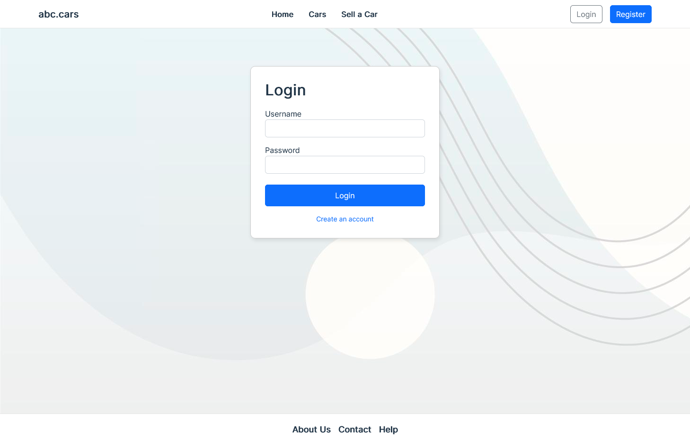
<p>Profile page</p>
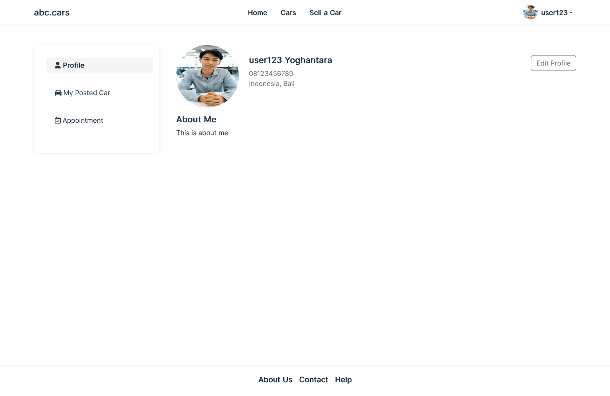
<p>Cars Page</p>
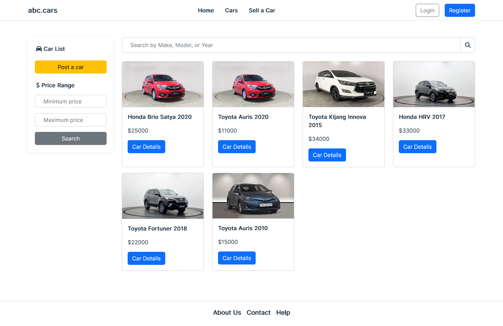
<p>Car Detail Page</p>
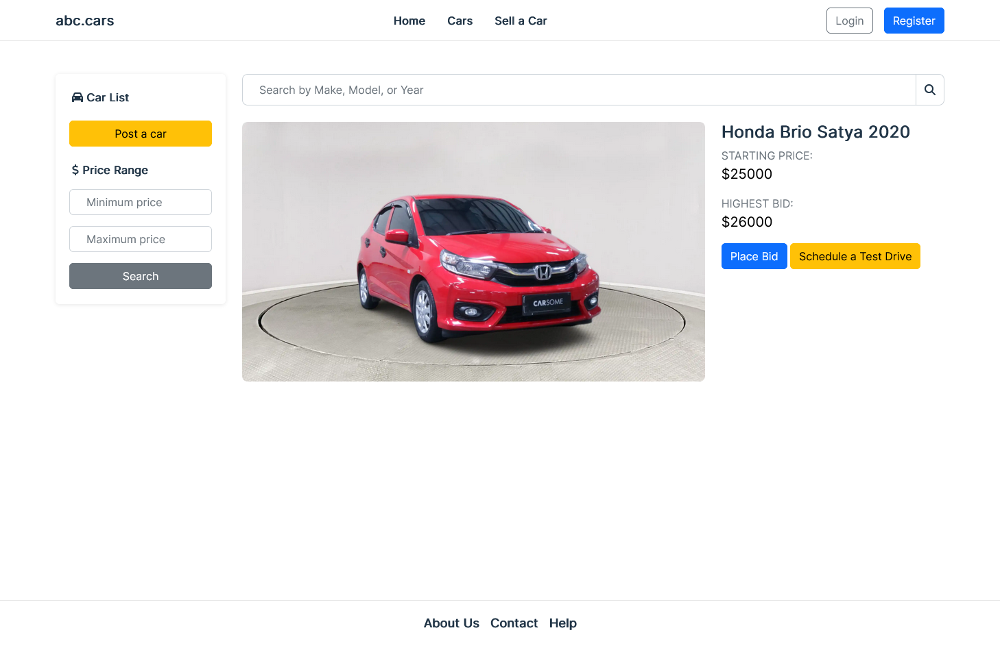
<p>Post Car</p>
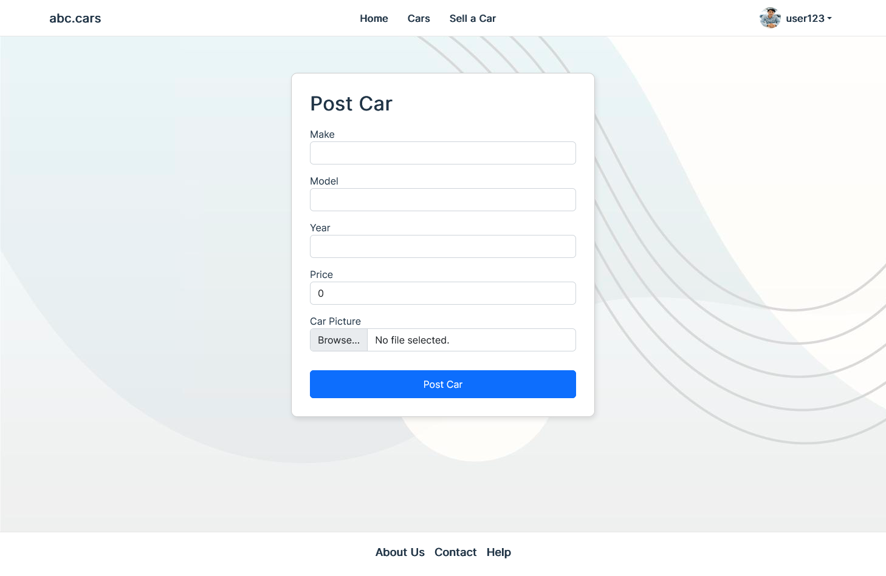
<p>Bid Car</p>
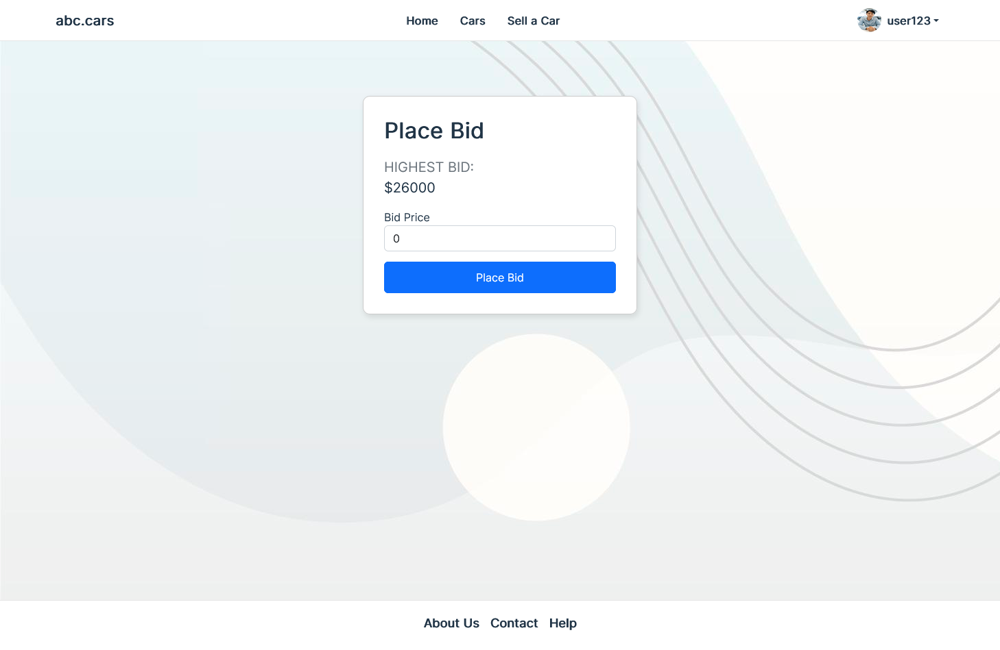
<p>Test Drive</p>
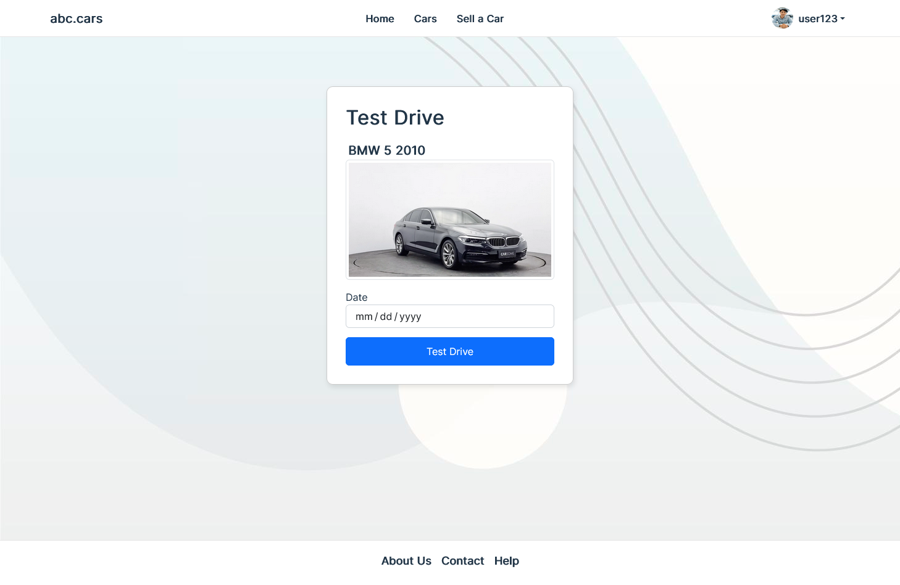
<p>Appointment</p>
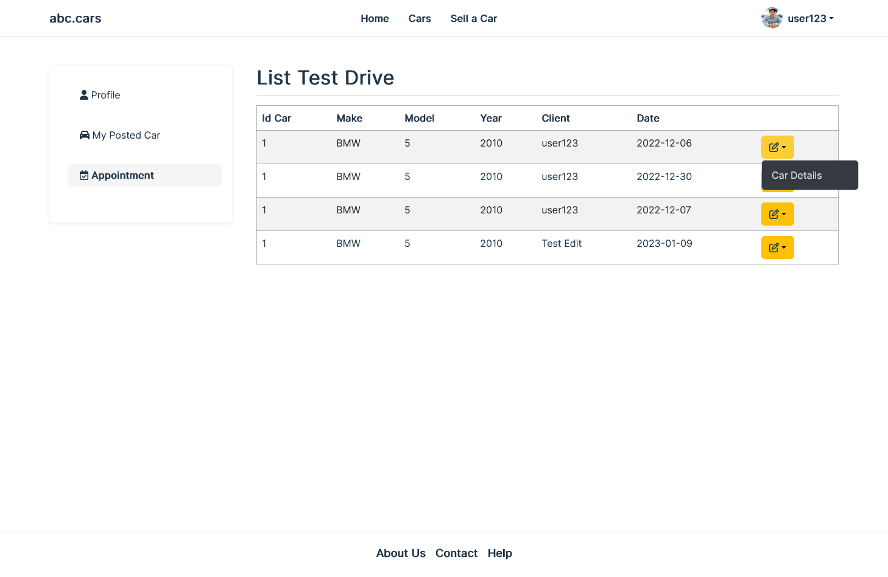
<p>My Posted Car</p>
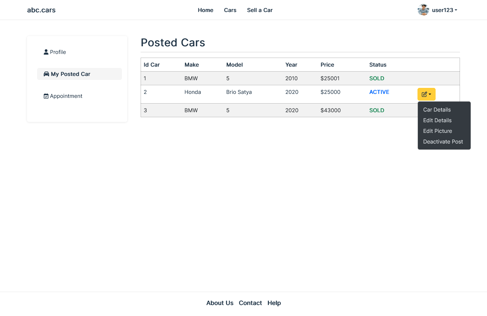
<p>About Page</p>
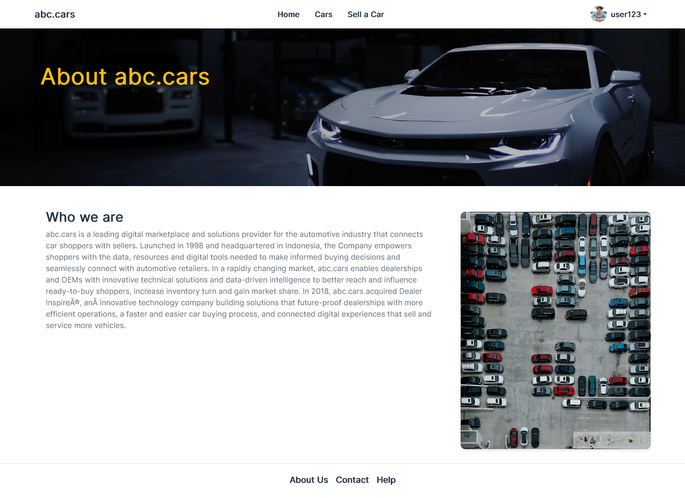
<p>Contact Page</p>
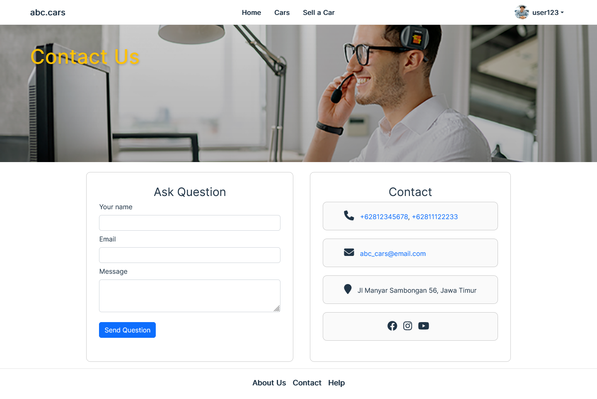
<p>Admin Pages</p>
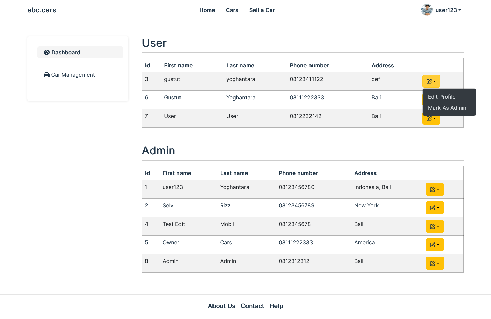
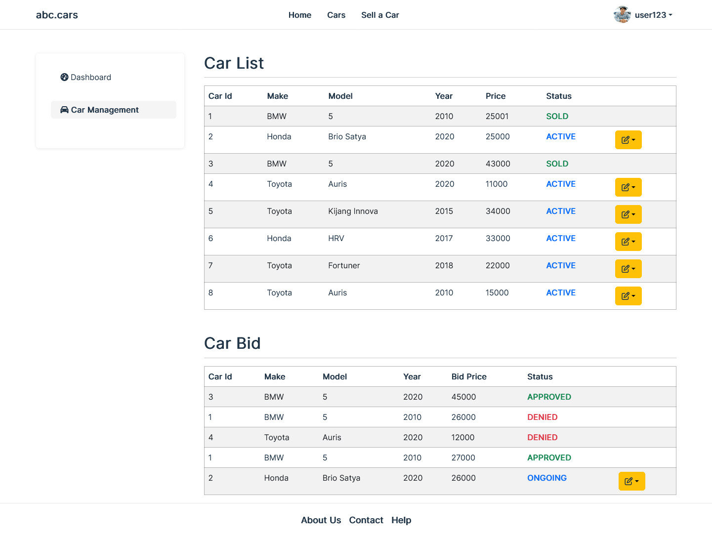
